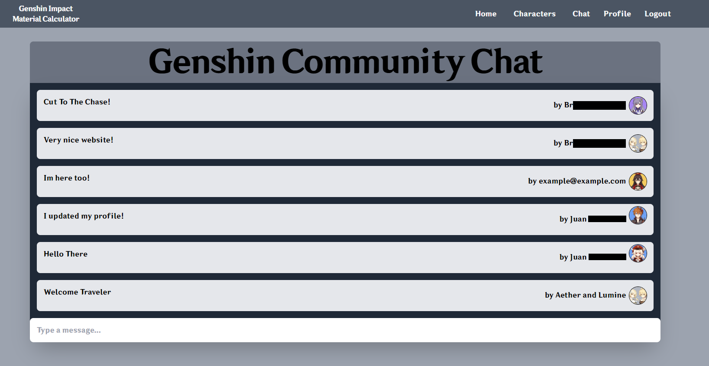

# Genshin Impact Material Calculator
This app uses Vue3.js, Vite, and Firebase in order create a simple material calculator with an embedded, live, chat! 

<div>
    
</div>

## Features 
- OAuth login with Google through Firebase 
- Secure user database managment via Firebase
- Live chat
- Material calculator for Genshin Impact characters
- Customizable profile

## Screenshots
### _Click to expand/collapse the screenshots:_
<details>
  <summary>Characters Page</summary>
  
  
</details>
<details>
  <summary>Chat Page</summary>
  
  
</details>
<details>
  <summary>Profile Page</summary>
  
  
</details>
<details>
  <summary>Material Calculator Page</summary>
  
  
</details>


## Required Files

In order for the live chat and Oauth login to function, you must add this file in the `/src` directory. 

```js
// firebaseConfig.js

const firebaseConfig = {
    apiKey: "YOUR_API_KEY",
    authDomain: "YOUR_AUTH_DOMAIN",
    projectId: "YOUR_PROJECT_ID",
    storageBucket: "YOUR_STORAGE_BUCKET",
    messagingSenderId: "YOUR_MESSAGING_SENDER_ID",
    appId: "YOUR_APP_ID",
    measurementId: "YOUR_MEASUREMENT_ID"
};

export default firebaseConfig;
```

---
---
# Vue 3 + Firebase Auth

## Recommended IDE Setup

- [VSCode](https://code.visualstudio.com/) + [Volar](https://marketplace.visualstudio.com/items?itemName=johnsoncodehk.volar)
